# QuantDev

A Python package for quantitative research and trading in Taiwan stock market.

## Table of Contents

- Data
    - [Databank](#Databank)
- Backtest
    - [backtesting](#backtesting)
        - [summary](#summary)
        - [report](#report)
        - [position_info](#position_info)
    - [meta_backtesting](#meta_backtesting)
        - [meta summary](#meta-summary)
        - [meta report](#meta-report)
        - [meta position info](#meta-position-info)
- Trade
    - [Position](#position)
    - [Portfolio](#portfolio)
    - [PortfolioManager](#portfoliomanager)
- How do I use it?
    - [before you start](#before-you-start)
    - [configuration](#configuration)

# Data

## Databank

The `Databank` class integrates multiple data sources and provides unified access to:

- TEJ (Taiwan Economic Journal) data
- FinMind data
- Public data (company information, risk-free rates)
- Processed (self-calculated) data (e.g., technical indicators)

```python
from quantdev.data import Databank

# Initialize the data manager
db = Databank()

# Read specific dataset
df = db.read_dataset('monthly_rev')

# Read with filters and column selection
df = db.read_dataset(
    dataset='stock_trading_data',
    filter_date='t_date',
    start='2023-01-01',
    end='2023-12-31',
    columns=['stock_id', '收盤價']
)

# List available datasets and columns
datasets = db.list_datasets()
columns = db.list_columns('stock_trading_data')
dataset = db.find_dataset('收盤價')  # Returns 'stock_trading_data'

# Update data
db.update_databank(include=['monthly_rev'])  # Update specific dataset
db.update_databank(exclude=['stock_basic_info'])  # Update all except specified
db.update_processed_data()  # Update processed data
```

# Backtest

## backtesting
The `backtesting()` function under the `quantdev.backtest` module tests trading strategies and returns a `Strategy` instance with analysis tools including:
- Performance metrics vs benchmark
- Position information tracking
- Interactive reporting with multiple views:
  - Equity curve
  - Relative return
  - Portfolio style
  - Return heatmap
  - Liquidity analysis
  - ...

```python
from quantdev.backtest import *

# Get data for strategy condition
data = get_factor('roe')  # Get ROE factor data

# Run backtest
strategy = backtesting(
    data > 0.9,  # condition
    rebalance='QR', # rebalance the weight every quarterly report release date
    signal_shift=1, # signal delay 1 day
    hold_period=20, # hold for 20 days
    stop_loss=-0.1, # stop loss 10%
    stop_profit=0.2, # stop profit 20%
    stop_at='next_day', # stop loss/profit at the next day of the condition
    start='2005-01-01', # backtest start date
    end='2023-12-31', # backtest end date
    benchmark='0050', # benchmark
)
```

### summary
```python
strategy.summary
```
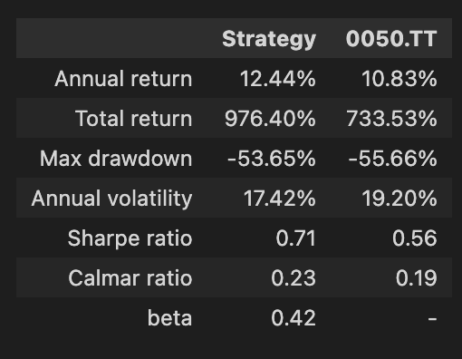

### report
```python
strategy.report
```
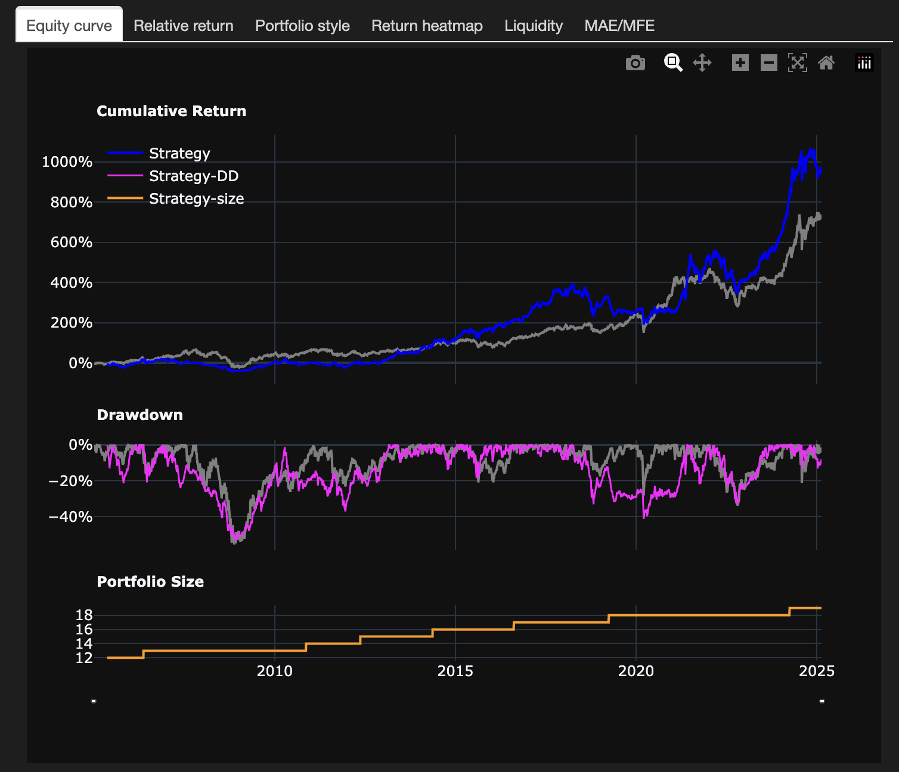

The `Strategy().report` includes several more tabs, including:

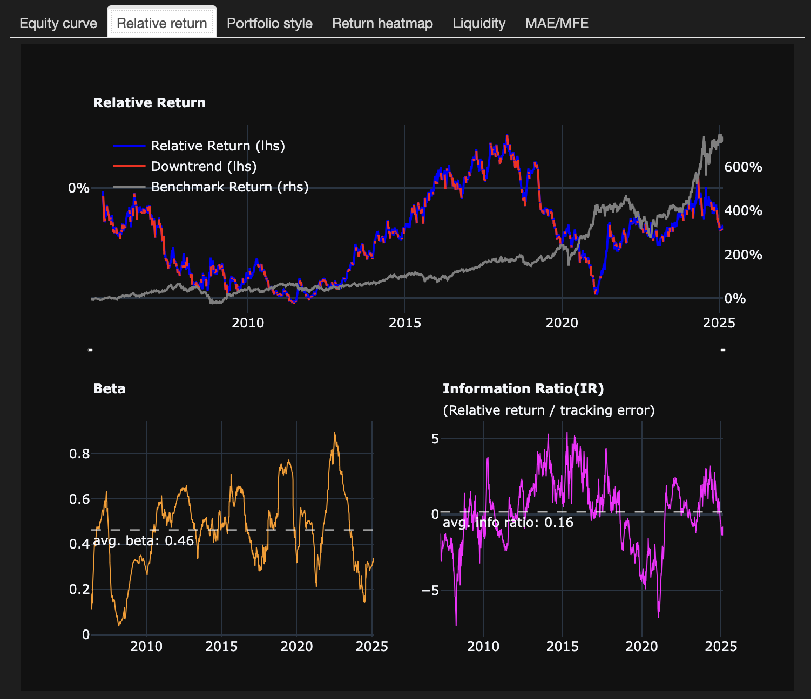

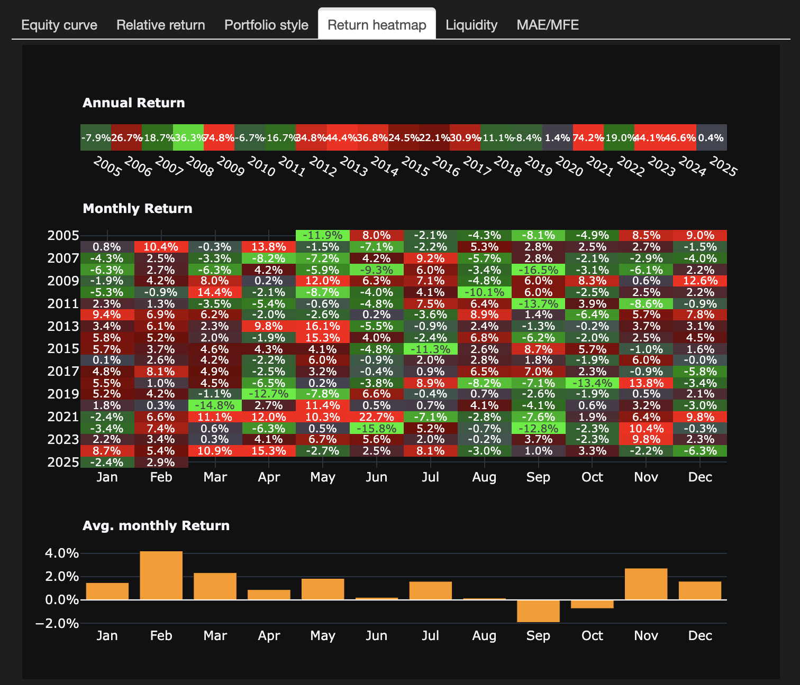
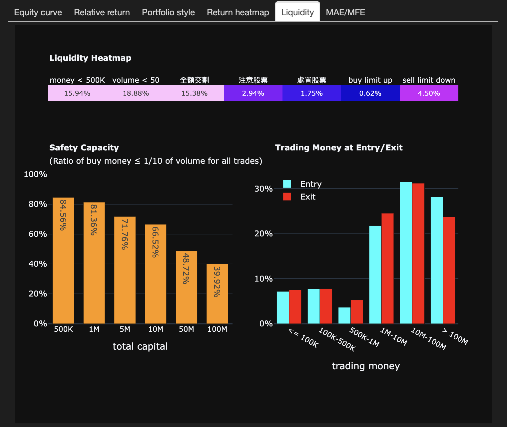
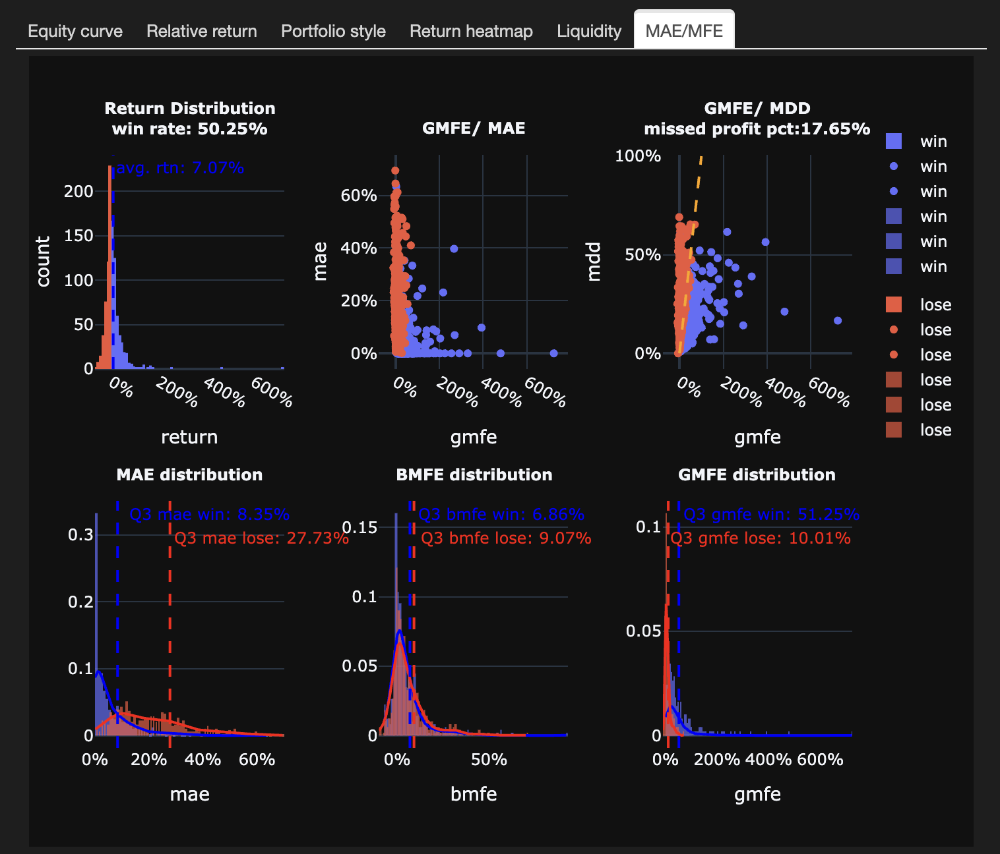

### position_info
```python
strategy.position_info
```
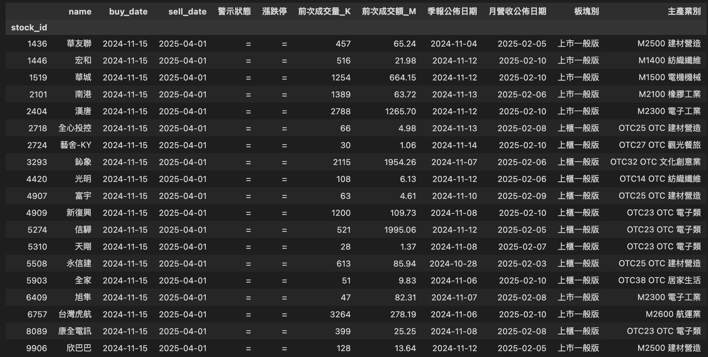

## meta_backtesting

The `meta_backtesting()` function under the `quantdev.backtest` module allows you to combine multiple strategies into a portfolio strategy. It returns a `MetaStrategy` instance with analysis tools including:
- Performance metrics vs original strategies and benchmark
- Position information tracking
- Interactive reporting with multiple views:
  - Equity curve
  - Efficient frontier
  - ...

```python
from quantdev.backtest import *

roe = get_factor('roe')
pbr = get_factor('股價淨值比')
mtm = get_factor('mtm_3m')

roe_strategy = backtesting(roe>=0.99, 'QR')
pbr_strategy = backtesting(pbr>=0.95, 'QR')
mtm_strategy = backtesting(mtm>=0.95, 'Q')

strategies = {
    'roe': (roe_strategy, 1),
    'pbr': (pbr_strategy, 1),
    'mtm': (mtm_strategy, 1),
}

metastrategy = meta_backtesting(
    strategies, 
    'QR', # rebalance the weight every quarterly report release date
)

```

### meta summary
```python
metastrategy.summary
```
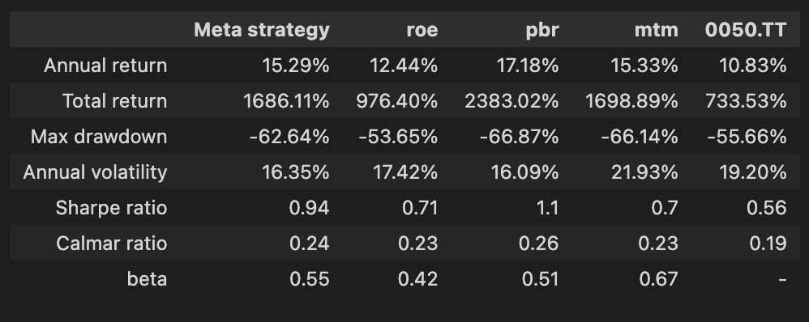

### meta report
```python
metastrategy.report
```
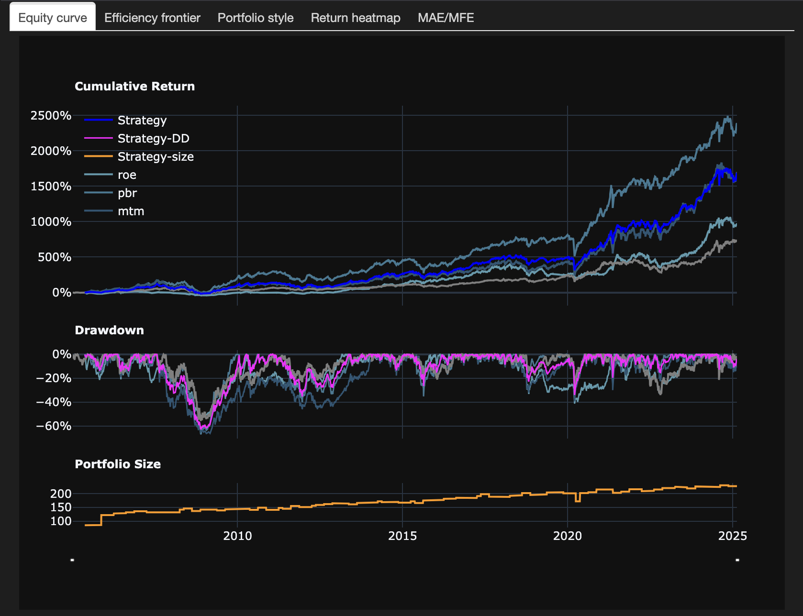


Particularly, the `meta_strategy.report` includes efficiency frontier and correlation matrix among all strategies:

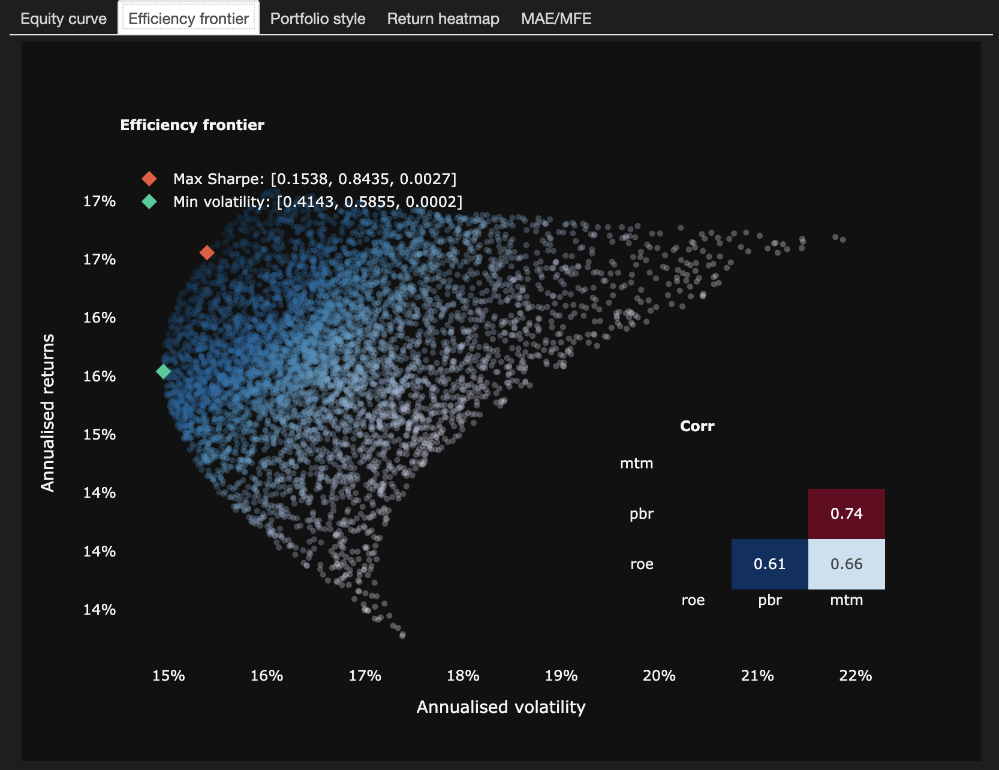

### meta position info

The `meta_strategy.position_info` includes position information of all strategies, also calculated the designated weight of each holding in the portfolio.

```python
metastrategy.position_info
```
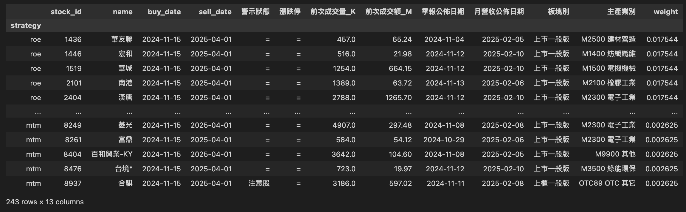

# Trade

The trading system implements institutional-grade execution via SinoPac's API with real-time market data integration from Fugle MarketData. The architecture consists of three core components:

1. `Position`: Precise position management with granular trade execution
2. `Portfolio`: Strategic portfolio construction and rebalancing
3. `PortfolioManager`: Automated execution engine with comprehensive risk controls

## Position

The `Position` class represents individual stock positions that will be managed in your portfolio:

```python
from quantdev.trade import Position

# Create positions for your trading strategy
tsmc_position = Position(('2330', 100000))    # 100,000 TWD of TSMC
hon_hai_position = Position(('2317', 50000))   # 50,000 TWD of Hon Hai
mediatek_position = Position(('2454', 80000))  # 80,000 TWD of MediaTek

# Update latest quotes before adding to portfolio
tsmc_position.refresh_quotes(price_tolerance=0.02, odd=True)
hon_hai_position.refresh_quotes(price_tolerance=0.02, odd=True)
mediatek_position.refresh_quotes(price_tolerance=0.02, odd=True)
```

## Portfolio

The `Portfolio` class combines multiple positions into strategy-based portfolios that will be executed:

```python
from quantdev.trade import Portfolio

# Create a portfolio with multiple trading strategies
portfolio = Portfolio({
    'tech_leaders': [tsmc_position, hon_hai_position],
    'semiconductor': [mediatek_position]
})

# Alternatively, create portfolio directly with stock symbols and allocation
portfolio = Portfolio({
    'tech_leaders': (['2330', '2317'], 150000),  # 150K TWD split between TSMC and Hon Hai
    'semiconductor': (['2454'], 80000)            # 80K TWD in MediaTek
})

# Ensure all position quotes are up-to-date before execution
portfolio.refresh_quotes()
```

## PortfolioManager

The `PortfolioManager` class executes and monitors your portfolio strategies in real-time:

```python
from quantdev.trade import SinoPacAccount, PortfolioManager

# Initialize SinoPac trading account
account = SinoPacAccount()  # Handles login automatically

# Create portfolio manager with your portfolio
pm = PortfolioManager(
    api=account,
    portfolio=None  # Automatically fetch portfolio from config/portfolio_path.json
)

# new portfolio (e.g., based on new strategy signals)
neportfolio_w = Portfolio({
    'tech_leaders': [
        Position(('2330', 120000)),  # Increase TSMC position
        Position(('2317', 30000))    # Decrease Hon Hai position
    ],
    'semiconductor': [
        Position(('2454', 100000)),  # Increase MediaTek position
        Position(('2379', 50000))    # Add new position in Realtek
    ]
})

# Update the portfolio
pm.update(neportfolio_w)

# Start automated portfolio management - this will:
# 1. Calculate position differences
# 2. Generate necessary buy/sell orders
# 3. Queue orders for execution
pm.run_portfolio_manager(
    freq=1,              # Update positions every minute
    ignore_bank_balance=False,  # Ensure sufficient funds
    ignore_mkt_open=False      # Trade only during market hours
)

```

# How do I use it?

## before you start

Before using QuantDev, ensure access to the following:

- Tej TQuantLab API credentials
- SinoPac securities trading account
- Fugle MarketData subscription

## configuration

Before using QuantDev, you'll need to set up your configuration files in a `config` directory. The module supports custom configuration paths:

```python
import quantdev
quantdev.set_config_dir('/path/to/config') # if not set, the default is ./config
```

The configuration directory should contain necessary API keys, trading parameters, and risk management settings.